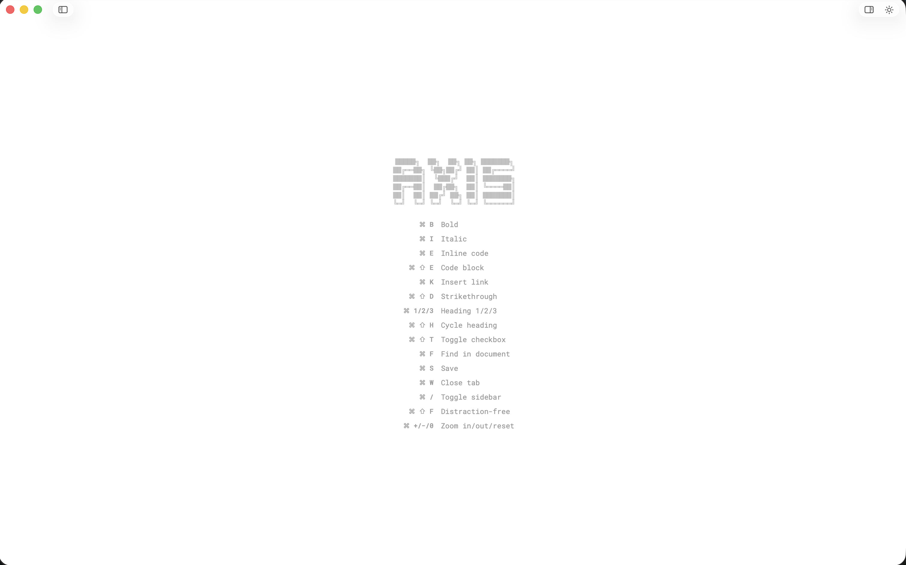
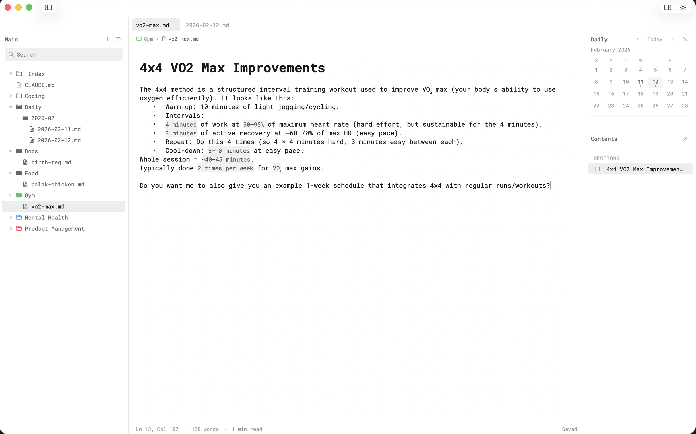
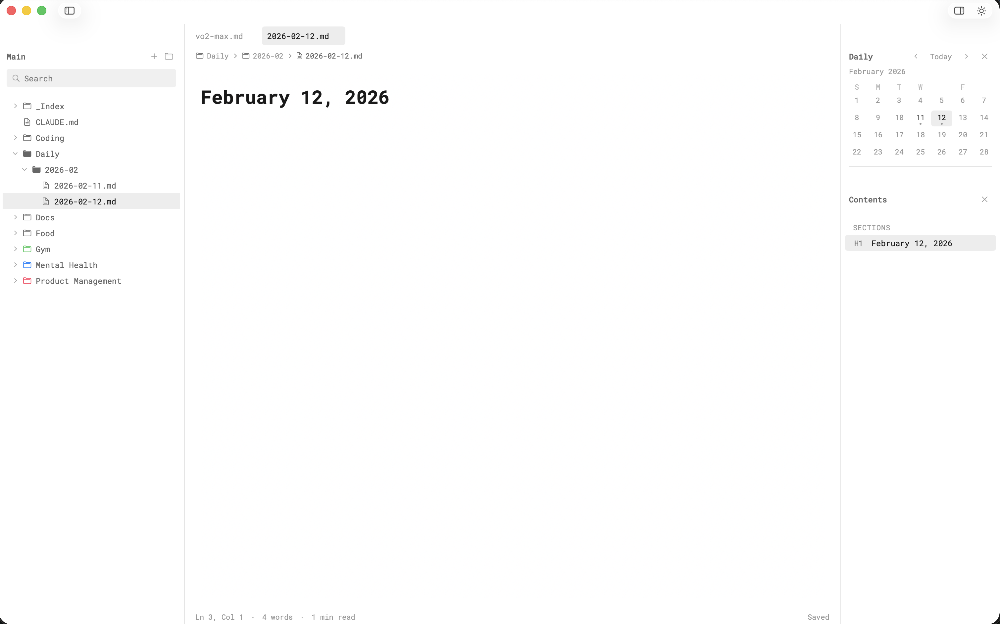
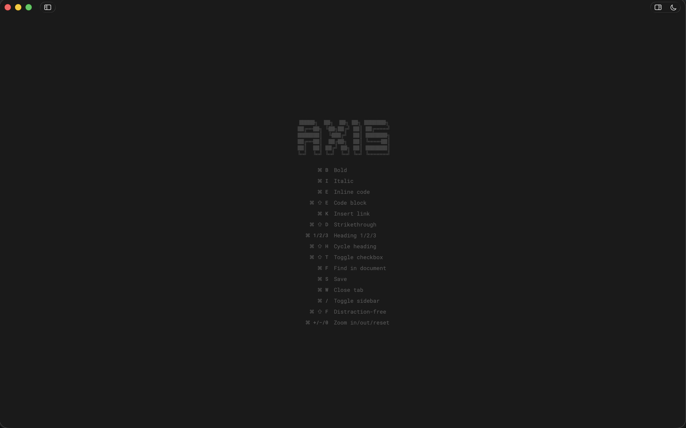
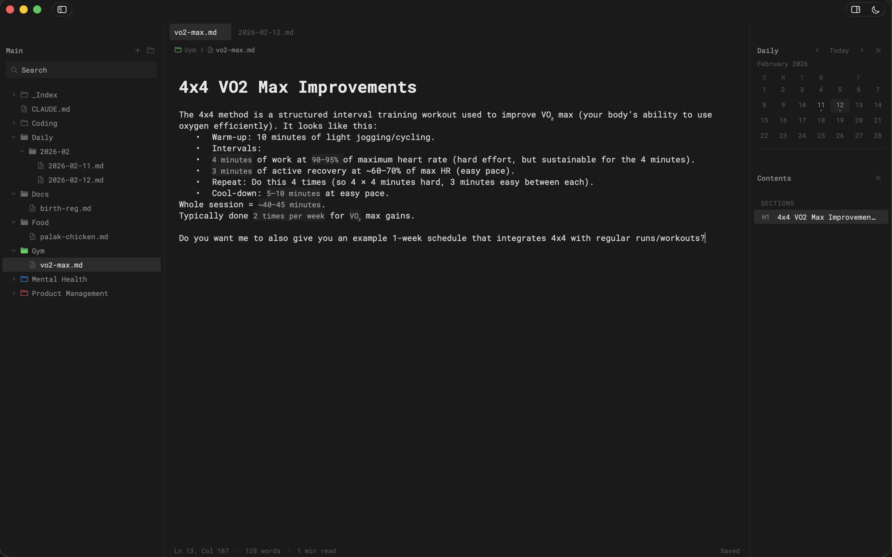
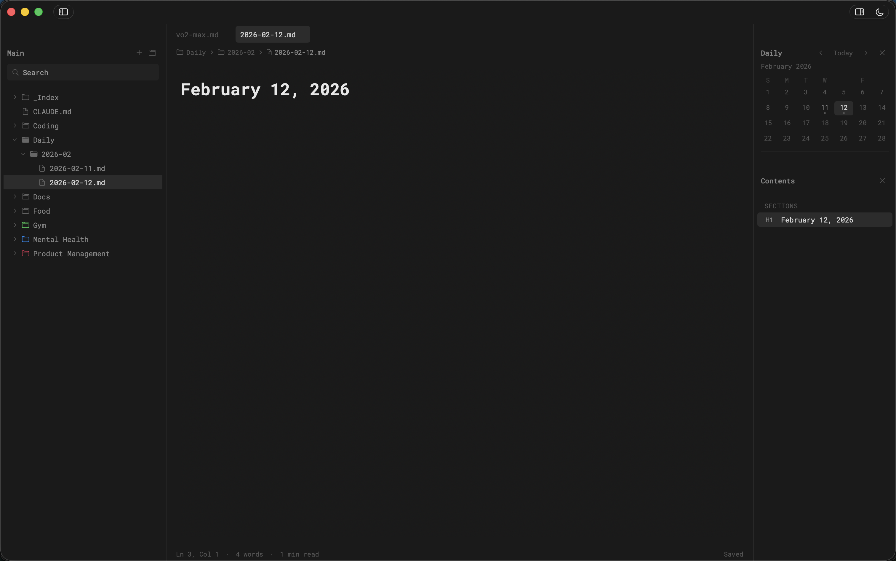

# Axis

Minimal, native macOS markdown editor built with SwiftUI + AppKit. Folder-based workspace, inline markdown rendering, and distraction-free writing.

<table>
  <tr>
    <td></td>
    <td></td>
    <td></td>
  </tr>
  <tr>
    <td></td>
    <td></td>
    <td></td>
  </tr>
</table>

## Features

- **Multi-tab editing** with dirty indicators and autosave
- **Inline markdown rendering** -- bold, italic, code, headings, links, strikethrough styled in real-time
- **Interactive checkboxes** -- visual checkbox rendering over `[ ]` / `[x]` syntax
- **Inline image preview** -- images embedded directly in the editor (PNG, JPEG, GIF, WebP, HEIC, SVG, and more)
- **Command palette** (`Cmd+P`) -- fuzzy search for commands, headings (`@`), and goto line (`:`)
- **Document outline** (`Cmd+Shift+O`) -- heading navigation with active section tracking
- **Daily notes with calendar** (`Cmd+Shift+C`) -- monthly calendar view, auto-organized `Daily/YYYY-MM/YYYY-MM-DD` folder structure
- **Built-in terminal** (`Cmd+J`) -- persistent shell session via SwiftTerm, resizable panel
- **Full-text search** (`Cmd+Shift+F`) -- search across all markdown files in the workspace
- **In-file search** (`Cmd+F`) -- find with match highlighting and navigation
- **Sidebar file tree** -- hierarchical navigation with custom folder icons and colors
- **Distraction-free mode** (`Cmd+/`) -- hide sidebar for focused writing
- **Zoom controls** -- `Cmd++` / `Cmd+-` / `Cmd+0` (50%-200%)
- **Dark / Light / System themes** -- cycle with `Cmd+T`
- **Breadcrumb navigation** -- current file path in the editor header
- **Status bar** -- line/column, word count, reading time, save status

## Build & Run

Requires macOS 13+ and Swift 5.9+.

1. Open `Package.swift` in Xcode.
2. Select the `Axis` scheme.
3. Run.

### Build a .app Bundle

```bash
scripts/build_app.sh
```

The app bundle will be at `dist/Axis.app`.

## Keyboard Shortcuts

### File Operations

| Shortcut | Action |
|----------|--------|
| `Cmd+O` | Open folder |
| `Cmd+N` | New markdown file |
| `Cmd+Shift+N` | New folder |
| `Cmd+S` | Save |
| `Cmd+W` | Close tab |
| `Cmd+Shift+Delete` | Delete file |

### Formatting

| Shortcut | Action |
|----------|--------|
| `Cmd+B` | Bold |
| `Cmd+I` | Italic |
| `Cmd+E` | Inline code |
| `Cmd+Shift+E` | Code block |
| `Cmd+Shift+D` | Strikethrough |
| `Cmd+K` | Insert link |
| `Cmd+Shift+I` | Insert image |
| `Cmd+Shift+H` | Cycle heading level |
| `Cmd+1/2/3` | Heading 1/2/3 |
| `Cmd+Shift+T` | Toggle checkbox |

### Search & Navigation

| Shortcut | Action |
|----------|--------|
| `Cmd+F` | Find in file |
| `Cmd+Shift+F` | Search all files |
| `Cmd+G` | Next match |
| `Cmd+Shift+G` | Previous match |
| `Cmd+P` | Command palette |

### View

| Shortcut | Action |
|----------|--------|
| `Cmd+/` | Toggle sidebar |
| `Cmd+Shift+O` | Toggle outline |
| `Cmd+Shift+C` | Toggle calendar |
| `Cmd+J` | Toggle terminal |
| `Cmd+Shift+L` | Toggle line wrap |
| `Cmd+T` | Cycle theme |
| `Cmd+{` | Previous tab |
| `Cmd+}` | Next tab |
| `Cmd++` | Zoom in |
| `Cmd+-` | Zoom out |
| `Cmd+0` | Reset zoom |

## Design

- **Font**: Roboto Mono throughout (bundled, 6 weights)
- **Theme**: Adaptive dark/light with subtle grayscale palette
- **Spacing**: 8px grid system
- **Philosophy**: Minimal UI, no distractions, smooth animations

## Notes

- The file tree shows `.md` files, image files, and folders. Hidden files are excluded.
- New files are always created with a `.md` extension.
- Autosave triggers after a 2-second debounce on text changes.
- Folder customizations (icons, colors) are persisted per project.
- Terminal opens in the current file's directory.
